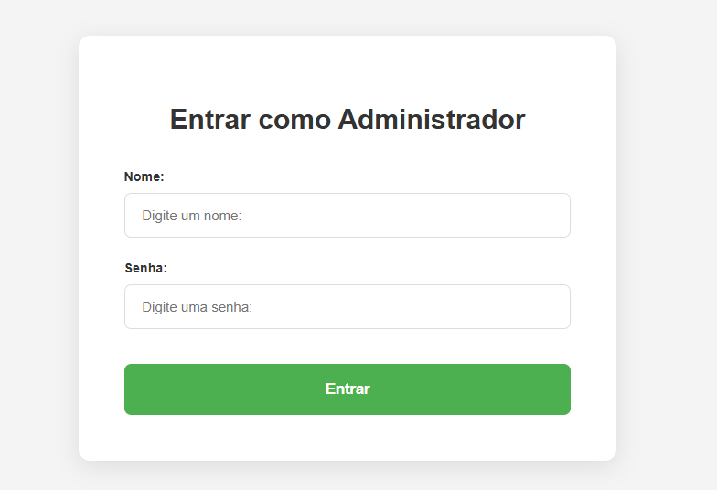
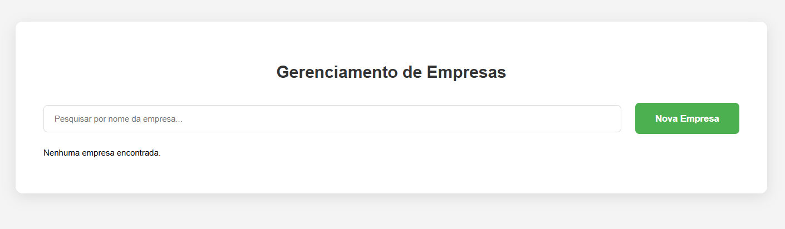

## Como Rodar o Projeto

### Pré-requisitos

- Python 3.10 ou superior
- Node.js e npm
- Um banco de dados PostgreSQL

### Backend

1.  **Crie um ambiente virtual e ative-o:**
    ```bash
    python -m venv venv
    source venv/bin/activate  # No Windows, use `venv\Scripts\activate`
    ```

2.  **Instale as dependências:**
    ```bash
    pip install -r backend/requirements.txt
    ```

3.  **Configure o banco de dados:**
    * Certifique-se de que seu servidor PostgreSQL esteja em execução.
    * Abra o arquivo `backend/database.py` e, se necessário, altere as credenciais do banco de dados (usuário, senha, host, porta, nome do banco de dados).

4.  **Inicie o servidor backend:**
    * Navegue até o diretório `backend`.
    * Execute o seguinte comando:
    ```bash
    uvicorn main:app --reload
    ```
    O servidor estará disponível em `http://127.0.0.1:8000`. Para testar as requisições da API, acesse o endpoint `/docs`.

### Frontend

1.  **Navegue até o diretório `frontend`:**
    ```bash
    cd frontend
    ```

2.  **Instale as dependências:**
    ```bash
    npm install
    ```

3.  **Inicie o servidor de desenvolvimento:**
    ```bash
    npm run dev
    ```
    A aplicação estará disponível em `http://localhost:5173`.

## Arquitetura do Projeto

### Backend

* `main.py`: Ponto de entrada da aplicação FastAPI. Configura o middleware CORS, inclui os roteadores e define as rotas de autenticação do administrador.
* `database.py`: Configura a conexão com o banco de dados PostgreSQL usando SQLAlchemy.
* `models.py`: Define os modelos de dados (`Empresa` e `Admin`) para o SQLAlchemy.
* `schemas.py`: Define os esquemas Pydantic para validação de dados de entrada e saída da API.
* `crud.py`: Contém as funções que realizam as operações de CRUD (Create, Read, Update, Delete) no banco de dados.
* `empresas.py`: Define as rotas da API relacionadas às empresas.
* `requirements.txt`: Lista as dependências Python do projeto.

### Frontend

* `index.html`: O ponto de entrada HTML da aplicação.
* `company_registration.html`: A página para o cadastro e gerenciamento de empresas.
* `src/main.jsx`: O ponto de entrada do JavaScript que renderiza o componente principal do aplicativo de login.
* `src/main_company.jsx`: O ponto de entrada do JavaScript que renderiza o componente principal do aplicativo de gerenciamento de empresas.
* `src/App.jsx`: Componente React para a tela de login do administrador.
* `src/company.jsx`: Componente React para a tela de gerenciamento de empresas, que permite adicionar, listar e remover empresas.
* `src/index.css`: Contém os estilos globais da aplicação.
* `package.json`: Lista as dependências e scripts do Node.js para o frontend.

## Tutorial de Login

Você será redirecionado para a página de administrador e, na primeira vez, criará um administrador único e permanente. Depois disso, você será redirecionado para a tela de cadastrar empresa.

### Tela de Adminstrador


### Tela de Cadastro de Empresas

